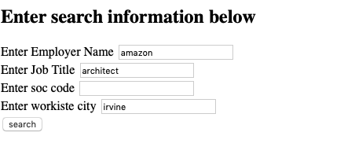
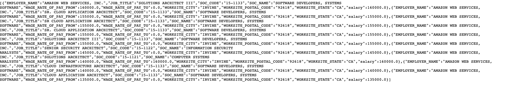

# Flask h1b web app

A web app that enables users to query the h1b database.

The tools used are:  
1. flask
2. sqlite

The h1b data can be found on https://www.dol.gov/agencies/eta/foreign-labor/performance.

The data for this project was sourced from H-1B FY2018.xlsx and loaded into a sqlite database named h1b.db. Due to size the h1b.db file is not saved in the repo. However, feel free to setup the db yourself using the source file and setup_db.py.

The code in api.py is repsonsible for creating the flask api that enables the client to send requests. You can demo this site at http://purplecouch.pythonanywhere.com.

At the moment the data returned is in json format.  

**Query example:**
  

**Response example:**

This is a work in progress. Functional and cosmetic improvements will be made overtime.

