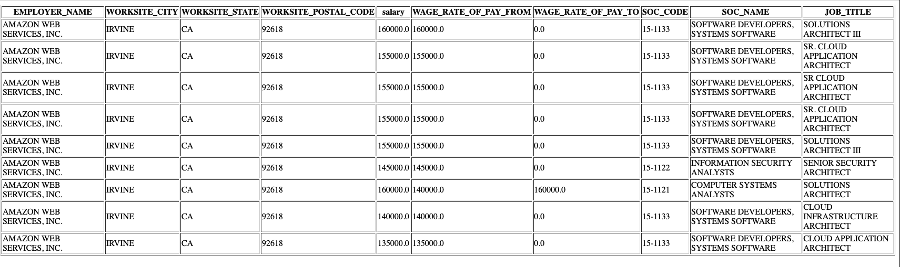

# Flask h1b web app


A web app that enables users to query the h1b database.

The tools used are:  
1. flask
2. sqlite

The h1b data can be found on https://www.dol.gov/agencies/eta/foreign-labor/performance.

The data for this project was sourced from H-1B FY2018.xlsx and loaded into a sqlite database named h1b.db. Due to size the h1b.db file is not saved in the repo. However, feel free to setup the db yourself using the source file and setup_db.py.

The code in api.py is repsonsible for creating the flask api that enables the client to send requests. You can demo this site at http://purplecouch.pythonanywhere.com.

Users can either query the data through the form on the web interface. Or they could query the data using the api.  

### Web Interface  

**Query example:**  


  

**Response example:**  





This is a work in progress. Functional and cosmetic improvements will be made overtime.

### API 

**request using python**  

```python
import request 
resp = requests.get('purplecouch.pythonanywhere.com/api/v1/h1b',params={'employer_name':'amazon','job_title':'architect','worksite_city':'irvine'})
```
**response**  
```bash
>>> r.json()
[{'EMPLOYER_NAME': 'AMAZON WEB SERVICES, INC.', 'JOB_TITLE': 'SOLUTIONS ARCHITECT III', 'SOC_CODE': '15-1133', 'SOC_NAME': 'SOFTWARE DEVELOPERS, SYSTEMS SOFTWARE', 'WAGE_RATE_OF_PAY_FROM': 160000.0, 'WAGE_RATE_OF_PAY_TO': 0.0, 'WORKSITE_CITY': 'IRVINE', 'WORKSITE_POSTAL_CODE': '92618', 'WORKSITE_STATE': 'CA', 'salary': 160000.0}, {'EMPLOYER_NAME': 'AMAZON WEB SERVICES, INC.', 'JOB_TITLE': 'SR. CLOUD APPLICATION ARCHITECT', 'SOC_CODE': '15-1133', 'SOC_NAME': 'SOFTWARE DEVELOPERS, SYSTEMS SOFTWARE', 'WAGE_RATE_OF_PAY_FROM': 155000.0, 'WAGE_RATE_OF_PAY_TO': 0.0, 'WORKSITE_CITY': 'IRVINE', 'WORKSITE_POSTAL_CODE': '92618', 'WORKSITE_STATE': 'CA', 'salary': 155000.0}, {'EMPLOYER_NAME': 'AMAZON WEB SERVICES, INC.', 'JOB_TITLE': 'SR CLOUD APPLICATION ARCHITECT', 'SOC_CODE': '15-1133', 'SOC_NAME': 'SOFTWARE DEVELOPERS, SYSTEMS SOFTWARE', 'WAGE_RATE_OF_PAY_FROM': 155000.0, 'WAGE_RATE_OF_PAY_TO': 0.0, 'WORKSITE_CITY': 'IRVINE', 'WORKSITE_POSTAL_CODE': '92618', 'WORKSITE_STATE': 'CA', 'salary': 155000.0}, {'EMPLOYER_NAME': 'AMAZON WEB SERVICES, INC.', 'JOB_TITLE': 'SR. CLOUD APPLICATION ARCHITECT', 'SOC_CODE': '15-1133', 'SOC_NAME': 'SOFTWARE DEVELOPERS, SYSTEMS SOFTWARE', 'WAGE_RATE_OF_PAY_FROM': 155000.0, 'WAGE_RATE_OF_PAY_TO': 0.0, 'WORKSITE_CITY': 'IRVINE', 'WORKSITE_POSTAL_CODE': '92618', 'WORKSITE_STATE': 'CA', 'salary': 155000.0}, {'EMPLOYER_NAME': 'AMAZON WEB SERVICES, INC.', 'JOB_TITLE': 'SOLUTIONS ARCHITECT III', 'SOC_CODE': '15-1133', 'SOC_NAME': 'SOFTWARE DEVELOPERS, SYSTEMS SOFTWARE', 'WAGE_RATE_OF_PAY_FROM': 155000.0, 'WAGE_RATE_OF_PAY_TO': 0.0, 'WORKSITE_CITY': 'IRVINE', 'WORKSITE_POSTAL_CODE': '92618', 'WORKSITE_STATE': 'CA', 'salary': 155000.0}, {'EMPLOYER_NAME': 'AMAZON WEB SERVICES, INC.', 'JOB_TITLE': 'SENIOR SECURITY ARCHITECT', 'SOC_CODE': '15-1122', 'SOC_NAME': 'INFORMATION SECURITY ANALYSTS', 'WAGE_RATE_OF_PAY_FROM': 145000.0, 'WAGE_RATE_OF_PAY_TO': 0.0, 'WORKSITE_CITY': 'IRVINE', 'WORKSITE_POSTAL_CODE': '92618', 'WORKSITE_STATE': 'CA', 'salary': 145000.0}, {'EMPLOYER_NAME': 'AMAZON WEB SERVICES, INC.', 'JOB_TITLE': 'SOLUTIONS ARCHITECT', 'SOC_CODE': '15-1121', 'SOC_NAME': 'COMPUTER SYSTEMS ANALYSTS', 'WAGE_RATE_OF_PAY_FROM': 140000.0, 'WAGE_RATE_OF_PAY_TO': 160000.0, 'WORKSITE_CITY': 'IRVINE', 'WORKSITE_POSTAL_CODE': '92618', 'WORKSITE_STATE': 'CA', 'salary': 160000.0}, {'EMPLOYER_NAME': 'AMAZON WEB SERVICES, INC.', 'JOB_TITLE': 'CLOUD INFRASTRUCTURE ARCHITECT', 'SOC_CODE': '15-1133', 'SOC_NAME': 'SOFTWARE DEVELOPERS, SYSTEMS SOFTWARE', 'WAGE_RATE_OF_PAY_FROM': 140000.0, 'WAGE_RATE_OF_PAY_TO': 0.0, 'WORKSITE_CITY': 'IRVINE', 'WORKSITE_POSTAL_CODE': '92618', 'WORKSITE_STATE': 'CA', 'salary': 140000.0}, {'EMPLOYER_NAME': 'AMAZON WEB SERVICES, INC.', 'JOB_TITLE': 'CLOUD APPLICATION ARCHITECT', 'SOC_CODE': '15-1133', 'SOC_NAME': 'SOFTWARE DEVELOPERS, SYSTEMS SOFTWARE', 'WAGE_RATE_OF_PAY_FROM': 135000.0, 'WAGE_RATE_OF_PAY_TO': 0.0, 'WORKSITE_CITY': 'IRVINE', 'WORKSITE_POSTAL_CODE': '92618', 'WORKSITE_STATE': 'CA', 'salary': 135000.0}]
```


